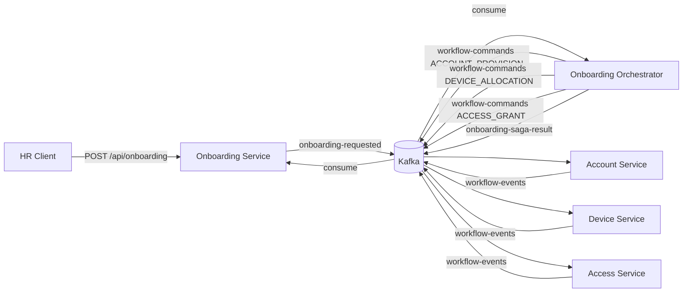
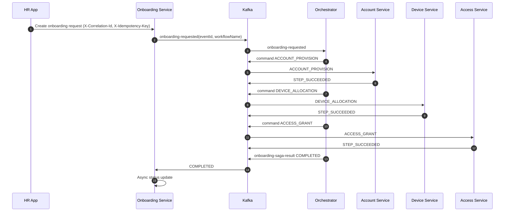
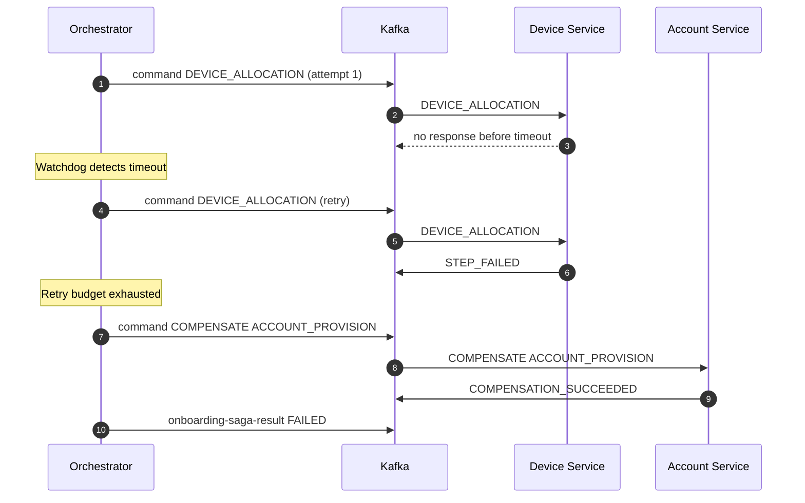

# Employee Onboarding Workflow: Production-Oriented System Design

## High-Level Flow

## Dynamic Workflow Engine

The orchestrator reads workflow definitions from configuration. Each workflow defines:

- start step
- next steps (supports fan-out)
- max retries per step
- timeout per step
- compensation graph

This enables changing behavior without code-level orchestration rewrites.

## Event Model

All events/commands carry:

- `eventId` for idempotent processing
- `correlationId` for traceability across services
- `sagaId` for workflow-level grouping
- `workflowName` at saga start

## Success Workflow

## Failure, Retry, Timeout and Compensation

## DLQ Replay Operations

The orchestrator captures DLQ records in-memory and exposes replay APIs:

- `GET /api/admin/dlq`
- `POST /api/admin/dlq/replay/{recordId}`
- `POST /api/admin/dlq/replay-all?sourceTopic=<topic.dlq>`

This provides operational recovery without touching Kafka directly.

## Reliability and Operability

- In-memory idempotency guards in all consumers to ignore duplicate `eventId`.
- API idempotency through `X-Idempotency-Key`.
- Retry with exponential backoff and automatic dead-letter routing (`*.dlq`).
- Dedicated DLQ consumers for operational visibility.
- Graceful shutdown with health/readiness probes for Kubernetes.
- Resource requests/limits, PDB, and HPA to improve runtime resilience.
